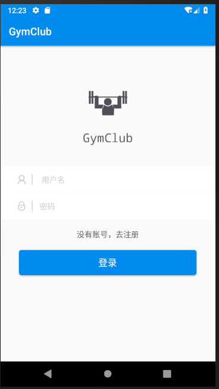
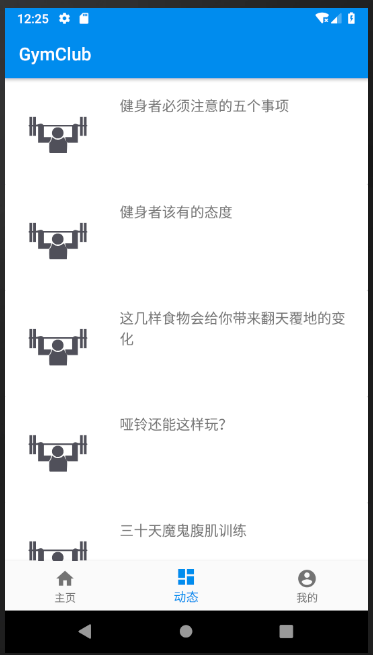
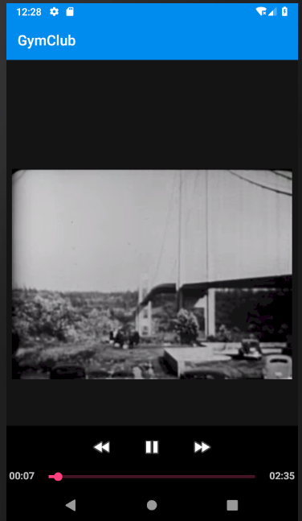
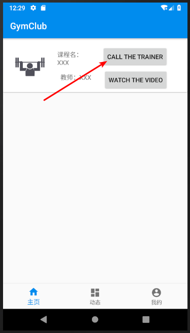
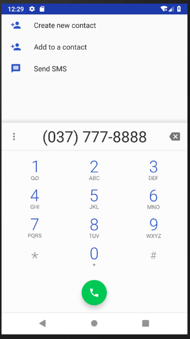
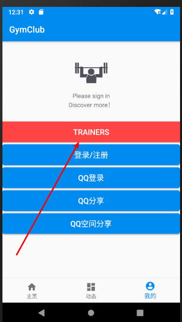
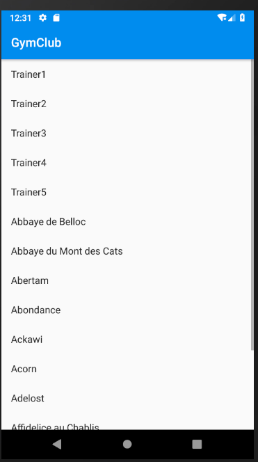
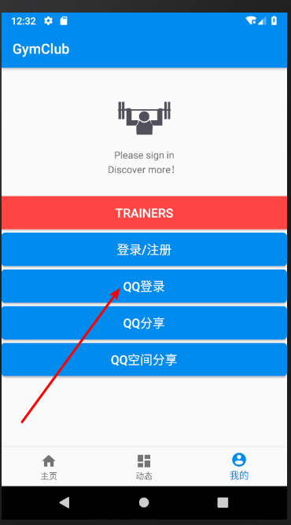
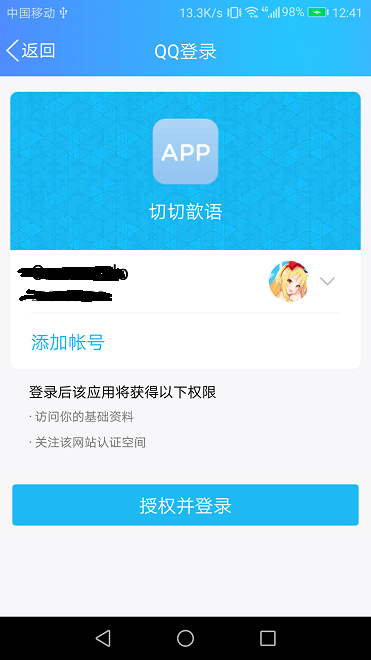

# GymClub
Android course assignment

## Student List

- 16301130
- 16301164
- 16301162

## Assignment 2 - User Log-in & Sign-up with Retrofit

## Assignment 2 - recycler view display

## Assignment 3 - Play online video (need a VPN to access google's server)

## Assignment 3 - Make phone calls

## Assignment 4 - Implement offline cache with a ContentProvider with Room API

## Assignment 5 - Sign in with QQ

